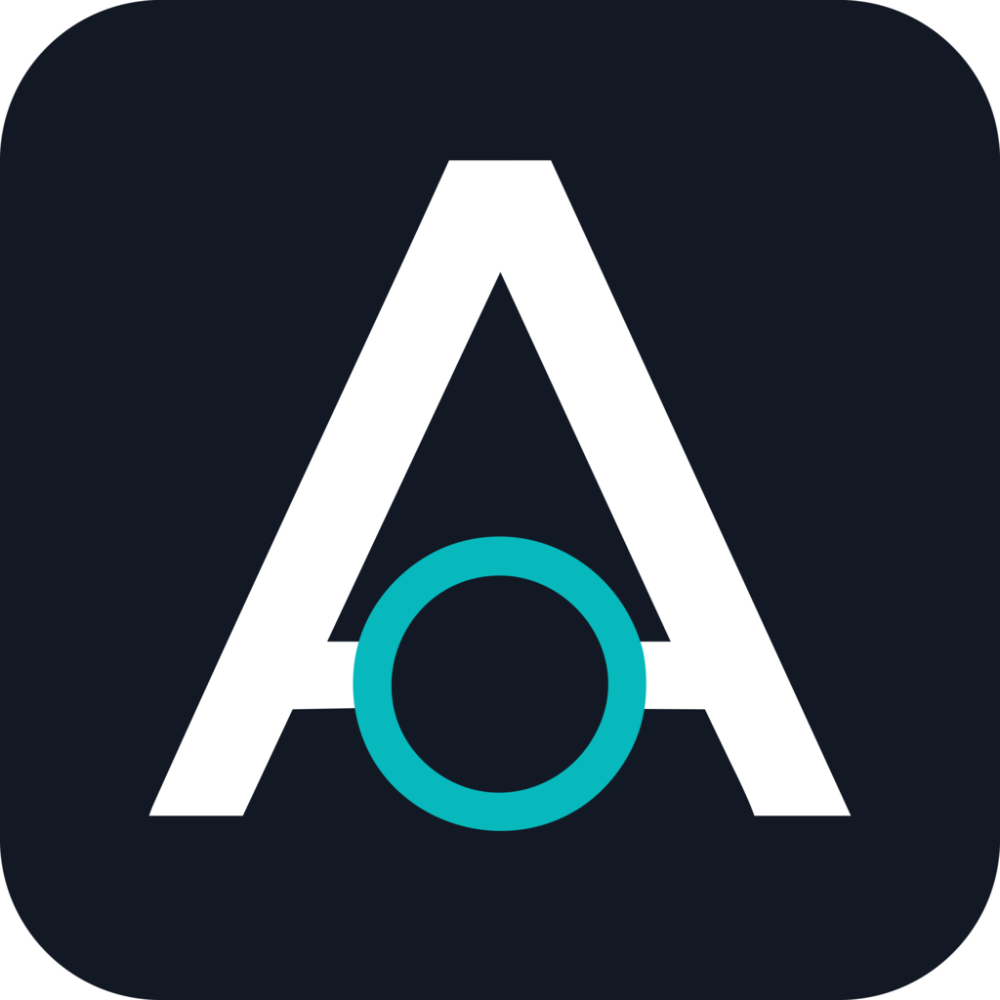
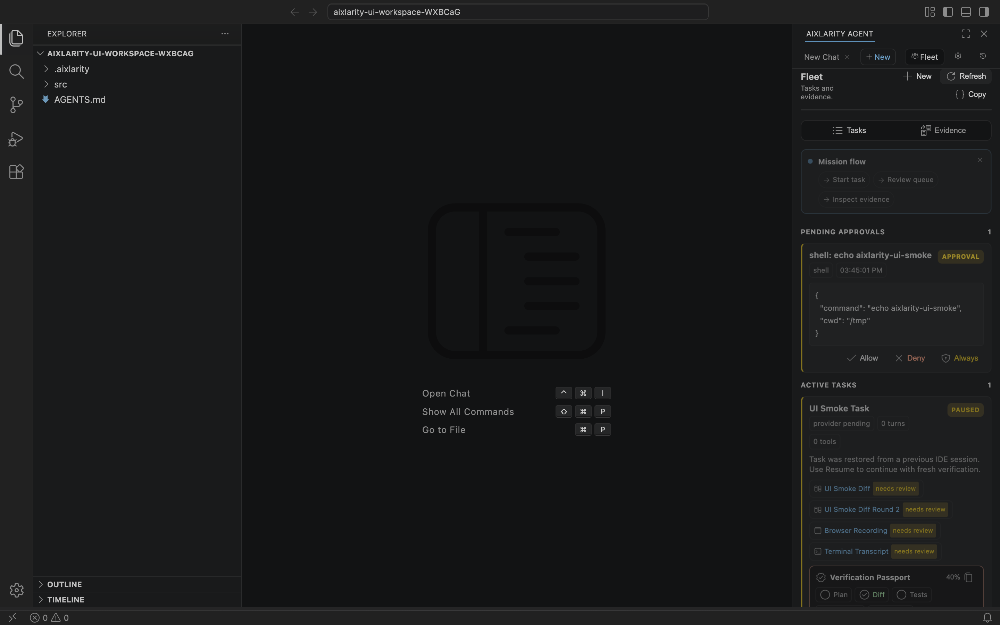

<p align="center">
  
</p>

<h1 align="center">Aixlarity IDE</h1>

<p align="center">
  <strong>An open-source AI agent IDE where every AI change is reviewable, replayable, and backed by evidence.</strong>
</p>

<p align="center">
  <a href="README.md">繁體中文版 README</a>
  ·
  <a href="http://eric-lam.com/Aixlarity/">Product docs</a>
  ·
  <a href="#quick-start">Quick start</a>
</p>

<p align="center">
  <a href="http://eric-lam.com/Aixlarity/"></a>
  <a href="https://github.com/voidful/Aixlarity/blob/main/LICENSE"></a>
</p>

<p align="center">
  
</p>

## Product Positioning

Aixlarity is an open-source, locally runnable, review-first AI coding agent IDE. It is not another chat panel inside an editor. It is an **Antigravity-style agent workbench** where tasks, approvals, diffs, terminals, browsers, providers, and learning rules all have state, evidence, and review points.

If AI agents are going to participate in real engineering workflows, they cannot simply say "done." Aixlarity makes the work inspectable:

| Product Pillar | What users get |
|----------------|----------------|
| **Mission Control** | Multi-workspace, multi-task, multi-agent orchestration with pause / resume / cancel / retry |
| **Artifact Review** | Plans, task lists, diffs, test reports, screenshots, and browser recordings become approvable artifacts |
| **Visual Diff Review** | JuxtaCode / Meld-style review across files, hunks, and AI edit rounds |
| **Evidence-first Automation** | Terminal Replay and Browser Evidence preserve command, cwd, stdout/stderr, exit code, DOM, console, network, and video |
| **Provider Freedom** | OpenAI, Anthropic, Gemini, OpenRouter, and local models can be scoped to user or workspace settings |
| **Knowledge Ledger** | Continuous learning is reviewable, exportable, and disableable instead of hidden memory |

## Why It Matters

Aixlarity is both a product and an open engineering book. The IDE is the product surface; the Rust runtime, provider layer, tool system, trust model, and artifact system are readable implementations. You can use it directly, or use it to learn how to build your own AI agent harness.

| Differentiator | Description |
|----------------|-------------|
| **Open-source Antigravity-style IDE** | Core AI IDE workflows made inspectable, modifiable, and verifiable |
| **Apple-like product discipline** | A calm, compact interface focused on tasks, evidence, review, models, and permissions |
| **Submission-ready gates** | `quality`, `contracts`, `ui`, and `submission` tests make product readiness enforceable |
| **Teaching by product** | The docs start from the real IDE surface, then trace behavior back into runtime code |
| **No vendor lock-in** | Providers, models, scopes, and secret hygiene have explicit UI and behavior contracts |

## Product Website

🌐 **[eric-lam.com/Aixlarity](http://eric-lam.com/Aixlarity/)**

The homepage is the Aixlarity IDE product landing page. It presents the workbench first, then maps Mission Control, Artifact Review, Browser Evidence, Terminal Replay, Provider Control, and Knowledge Ledger back to harness engineering concepts.

### Entry Paths

| Time | Path | For |
|------|------|-----|
| 5 min | Home → IDE Demo Workshop | Quickly understand what the product does |
| 10 min | IDE Harness Lab → Aixlarity IDE | Learn the core UX of an agent workbench |
| 30 min | Evidence → Provider → Trust → Knowledge Ledger | Evaluate reliability, reviewability, and control |
| 1 hour | Comparison → Source code | Fork, modify, or build your own agent IDE |

## What Aixlarity Learned From Each Source

| Source | Design Patterns | Source Code |
|--------|----------------|-------------|
| **Claude Code** | Prompt assembly, Tool trait, Trust boundaries, Skill system | `prompt.rs`, `tools.rs`, `trust.rs`, `skills.rs` |
| **Gemini CLI** | Terminal-first REPL, MCP client, Token caching, Streaming | `main.rs`, `mcp.rs`, `cache.rs`, `output.rs` |
| **OpenAI Codex** | Sandbox levels, Permission model, apply-patch | `tools/container.rs`, `agent/permissions.rs`, `tools/apply_patch.rs` |
| **Hermes Agent** | Skill learning loop, Dual memory, Memory safety scan, Session search | `skills.rs`, `tools/memory_tool.rs`, `tools/skill_manager.rs` |

## Quick Start

```bash
git clone https://github.com/voidful/Aixlarity.git && cd Aixlarity
cargo build --release

# Set at least one API key
export GEMINI_API_KEY="AIza..."      # Highest free quota

# Start interactive REPL
./target/release/aixlarity

# Or run a single task
aixlarity exec "Explain the architecture of this codebase"
```

## Built-in Skills (10)

Aixlarity's `.aixlarity/skills/` directory contains reusable agent skills in YAML frontmatter format (compatible with [Hermes Agent](https://github.com/NousResearch/hermes-agent)):

code-review, systematic-debugging, tdd, writing-plans, security-audit, refactoring, documentation-review, git-workflow, performance-analysis, architecture-review

## Architecture

```
crates/
├── aixlarity-core/          # Core logic library (~12,000 lines)
│   ├── agent.rs       # Agent execution loop + Permission + Streaming + Memory
│   ├── tools/         # 11 built-in tools + coordinator (930-line DAG scheduler)
│   ├── providers.rs   # Multi-provider management (Gemini / OpenAI / Anthropic)
│   ├── prompt.rs      # Prompt assembly engine
│   ├── session.rs     # Session persistence
│   ├── trust.rs       # Three-level trust model
│   ├── skills.rs      # Skill system + YAML frontmatter + Progressive Disclosure
│   ├── mcp.rs         # MCP client
│   └── hooks.rs       # PreToolUse / PostToolUse lifecycle hooks
├── aixlarity-cli/           # CLI entry point
│   └── main.rs        # clap 4 + rustyline REPL
aixlarity-ide/               # VS Code fork / graphical harness workbench
└── src/vs/workbench/contrib/aixlarity/browser/
    ├── aixlarity.contribution.ts
    ├── aixlarityView.ts
    └── aixlarity*View.ts          # Artifact / Diff / Provider / Knowledge / Mission modules
```

## Aixlarity IDE

The IDE is the product surface for the harness:

| Capability | Product behavior |
|------------|------------------|
| Mission Control | Multi-workspace / task / artifact / approval control with pause / resume / cancel / retry |
| Artifact Review | Implementation Plan, Task List, Diff, Test Report, Screenshot, Browser Recording, and Terminal Transcript review |
| Visual Diff Review | Side-by-side / unified diffs, compare rounds, hunk review, review gates, and anchored comments |
| Integrated Browser Agent | DOM, console, network, screenshot, video, and action timeline become evidence |
| Terminal Replay | Command ownership, cwd, env summary, stdout/stderr, exit code, duration, and dangerous command approvals |
| Provider Control Center | User/workspace scope, presets, import/export bundles, required model fields, and secret hygiene |
| Knowledge Ledger | Rules / memory / workflow / MCP activation are reviewable, exportable, and disableable |
| Editor-native Actions | Diagnostics, Problems, selections, and terminal output can be sent to the agent without leaving the editor |

IDE validation:

```bash
cd aixlarity-ide
npm run test-aixlarity-quality
npm run test-aixlarity-contracts
npm run test-aixlarity-submission
npm run test-aixlarity-ui
npm run compile-check-ts-native
npm run compile
```

## Contributing

See [CONTRIBUTING.md](CONTRIBUTING.md). Contributions in both Traditional Chinese and English are welcome.

## License

Apache-2.0
