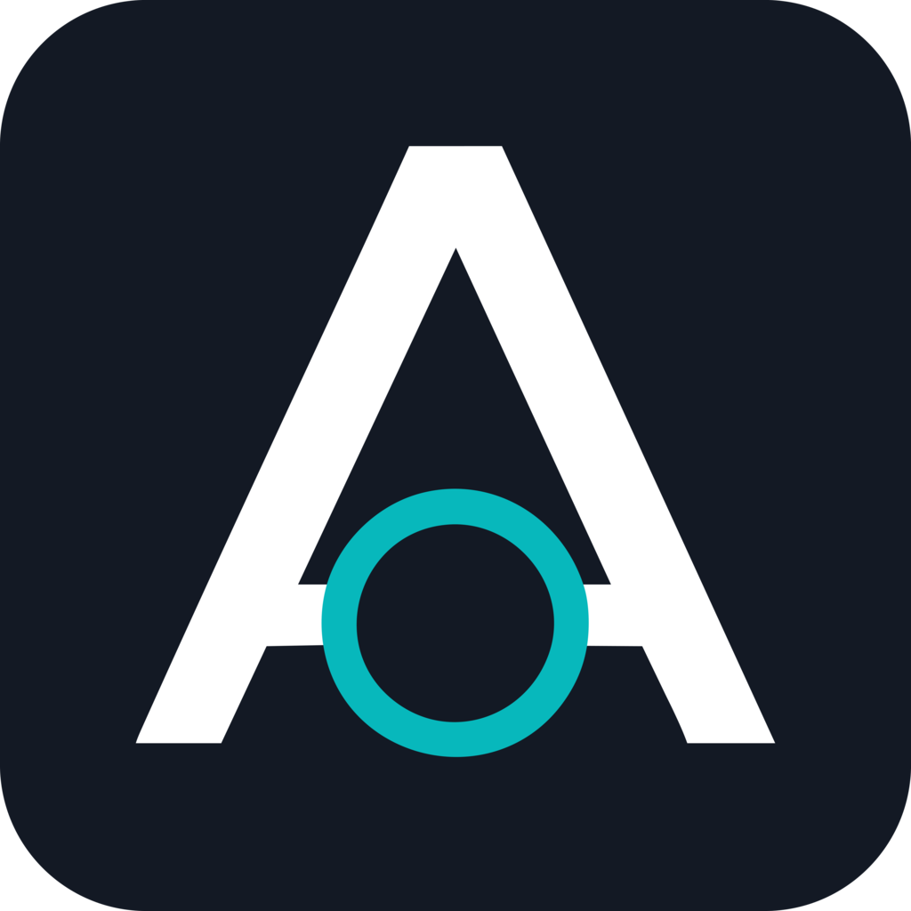

<p align="center">
  
</p>

<h1 align="center">Aixlarity IDE</h1>

<p align="center">
  <strong>讓 AI 改程式，不只會說，也要留紀錄。</strong>
</p>

<p align="center">
  <a href="README.en.md">English README</a>
  ·
  <a href="https://aixlarity.com">Product website</a>
  ·
  <a href="https://github.com/voidful/Aixlarity/releases/latest">Download</a>
  ·
  <a href="#快速開始">Quick start</a>
</p>

<p align="center">
  <a href="https://aixlarity.com"></a>
  <a href="https://github.com/voidful/Aixlarity/releases/latest"></a>
  <a href="https://github.com/voidful/Aixlarity/blob/main/LICENSE"></a>
</p>

<p align="center">
  
</p>

## 先講直覺

你可以把 Aixlarity 想成一個「會留下工作紀錄的 AI IDE」。

一般 AI coding assistant 常常像一個很會回答問題的人：它說它改好了、它說它測過了，但你要自己回頭看 diff、翻 terminal、確認它到底做了什麼。Aixlarity 想解決的是這件事：**AI 可以幫你改程式，但每一步都要看得見、查得到、能退回。**

所以 Aixlarity 不是只多做一個聊天側邊欄。它把 AI agent 的工作拆成幾個人類真的需要確認的部分：

| 產品賣點 | 使用者得到什麼 |
|----------|----------------|
| **Mission Control** | 把長任務放進任務控制台，而不是散在聊天紀錄裡 |
| **Visual Diff Review** | 像 JuxtaCode / Meld 一樣，逐檔、逐段確認 AI 到底改了什麼 |
| **Terminal Replay** | AI 說「測過了」時，你能看到 command、cwd、stdout/stderr、exit code |
| **Browser Evidence** | 前端驗收不只截圖，也能留下 DOM、console、network、screenshot、video |
| **Provider Control** | OpenAI、Anthropic、Gemini、OpenRouter、本地模型可以依個人或專案切換，API key 不進匯出檔 |
| **Knowledge Ledger** | AI 學到的規則、記憶、工作流程都可審核、可匯出、可關閉，不是黑箱記憶 |

## 再打開盒子：Harness 是什麼？

AI 模型本身比較像引擎：很會推理、很會寫文字、也很會補程式碼。但它不會自己決定能不能讀檔、不會自己知道哪些 shell 指令危險、不會自己記錄每一次工具呼叫。包在模型外面、負責這些工程工作的那一層，就叫做 **harness**。

換句話說：

- 模型負責「想要怎麼做」。
- Harness 負責「能不能做、怎麼做、做完留下什麼紀錄」。
- IDE 負責把這些過程變成人看得懂、按得下去、審得過去的介面。

Aixlarity 同時是一個產品，也是一份打開的工程教材。你可以直接下載 IDE 來用，也可以一路追進 Rust runtime、provider layer、tool system、trust model、artifact system，學會一個 agent harness 是怎麼被做出來的。

## 為什麼值得關注

| 差異化 | 說明 |
|--------|------|
| **開源版 agent IDE** | 把商業 AI IDE 的核心工作流程做成可研究、可驗證、可改造的開源版本 |
| **介面保持克制** | 只把任務、證據、審核、模型、權限這些核心決策放到前面 |
| **品質有門檻** | `quality`、`contracts`、`ui`、`submission` 測試把產品品質變成提交條件 |
| **邊用邊學** | 文件不是旁觀式教材，而是從真實 IDE 介面一路追到 runtime 原始碼 |
| **不綁單一模型** | 模型供應商、模型 ID、作用範圍、金鑰保護都有明確 UI 與行為 contract |

## 網站和閱讀路線

🌐 **[aixlarity.com](https://aixlarity.com)**

首頁就是 Aixlarity IDE 的產品入口。它先用最短的方式講清楚 IDE 能做什麼，再把 Mission Control、Visual Diff Review、Browser Evidence、Terminal Replay、Provider Control、Knowledge Ledger 對回 harness engineering 概念。

### 進入路徑

| 時間 | 路徑 | 適合誰 |
|------|------|--------|
| 5 分鐘 | 首頁 → IDE Demo 工作坊 | 想先看這個 IDE 到底能做什麼 |
| 10 分鐘 | IDE Harness Lab → Aixlarity IDE | 想用畫面理解 harness 的核心概念 |
| 30 分鐘 | Evidence → Provider → Trust → Knowledge Ledger | 想評估它是否可靠、可審核、可控 |
| 1 小時 | 對照章 → 原始碼 | 想 fork、改造或打造自己的 agent IDE |

## 下載 Aixlarity IDE

Release workflow 會在原生 runner 上產出 macOS、Windows、Linux x64/arm64 版本，並把所有檔案附上 SHA-256 checksum。最新版本統一從 **[GitHub Releases](https://github.com/voidful/Aixlarity/releases/latest)** 下載。

| 系統 | 下載 |
|------|------|
| macOS Apple silicon | [Aixlarity-darwin-arm64.dmg](https://github.com/voidful/Aixlarity/releases/latest/download/Aixlarity-darwin-arm64.dmg) |
| macOS Intel | [Aixlarity-darwin-x64.dmg](https://github.com/voidful/Aixlarity/releases/latest/download/Aixlarity-darwin-x64.dmg) |
| Windows x64 | [Aixlarity-win32-x64-user-setup.exe](https://github.com/voidful/Aixlarity/releases/latest/download/Aixlarity-win32-x64-user-setup.exe) |
| Windows arm64 | [Aixlarity-win32-arm64-user-setup.exe](https://github.com/voidful/Aixlarity/releases/latest/download/Aixlarity-win32-arm64-user-setup.exe) |
| Linux x64 | [deb](https://github.com/voidful/Aixlarity/releases/latest/download/Aixlarity-linux-x64.deb) · [rpm](https://github.com/voidful/Aixlarity/releases/latest/download/Aixlarity-linux-x64.rpm) · [tar.gz](https://github.com/voidful/Aixlarity/releases/latest/download/Aixlarity-linux-x64.tar.gz) |
| Linux arm64 | [deb](https://github.com/voidful/Aixlarity/releases/latest/download/Aixlarity-linux-arm64.deb) · [rpm](https://github.com/voidful/Aixlarity/releases/latest/download/Aixlarity-linux-arm64.rpm) · [tar.gz](https://github.com/voidful/Aixlarity/releases/latest/download/Aixlarity-linux-arm64.tar.gz) |

第一次開啟尚未簽章的預覽版時，系統可能需要你手動信任。下載後可用 [SHASUMS256.txt](https://github.com/voidful/Aixlarity/releases/latest/download/SHASUMS256.txt) 驗證檔案。

## 快速開始：先用，再拆

```bash
# 編譯
git clone https://github.com/voidful/Aixlarity.git && cd Aixlarity
cargo build --release

# 設定至少一個模型供應商金鑰
export GEMINI_API_KEY="AIza..."
# 或 export OPENAI_API_KEY="sk-..."

# 啟動互動式 REPL
./target/release/aixlarity

# 或執行單次任務
aixlarity exec "解釋這個 codebase 的架構"
```

如果你只是想試 IDE，建議先從 [GitHub Releases](https://github.com/voidful/Aixlarity/releases/latest) 下載圖形化版本。上面的指令比較適合想讀 runtime、改 CLI、或研究 agent harness 的人。

## 原始碼怎麼看

這個 repo 可以分成三層來讀：

| 層次 | 你會看到什麼 | 適合誰 |
|------|--------------|--------|
| **IDE** | Mission Control、diff 審核、瀏覽器證據、終端機回放 | 想知道產品怎麼用的人 |
| **CLI / Daemon** | JSON-RPC、互動式 REPL、單次任務執行 | 想串接或除錯的人 |
| **Core runtime** | agent loop、工具、權限、provider、prompt、session | 想學 harness 怎麼做的人 |

```
crates/
├── aixlarity-core/          # 核心邏輯庫（~12,000 行）
│   ├── agent.rs       # Agent 執行迴圈 + Permission + Streaming + Memory
│   ├── tools/         # 11 個內建工具 + coordinator（930 行 DAG 排程）
│   ├── providers.rs   # 多模型供應商管理（Gemini / OpenAI / Anthropic）
│   ├── prompt.rs      # Prompt 組裝引擎
│   ├── session.rs     # Session 持久化
│   ├── trust.rs       # 三級信任模型
│   ├── skills.rs      # 技能系統 + YAML frontmatter + Progressive Disclosure
│   ├── instructions.rs # 規範檔載入 + Persona 載入 + 工具限制解析
│   ├── mcp.rs         # MCP 客戶端
│   └── hooks.rs       # PreToolUse / PostToolUse 生命週期鉤子
├── aixlarity-cli/           # CLI 入口
│   └── main.rs        # clap 4 + rustyline REPL
aixlarity-ide/               # 圖形化 IDE（VS Code fork）
├── src/vs/workbench/contrib/aixlarity/browser/
│   ├── aixlarity.contribution.ts  # 註冊 sidebar view + context tracker
│   ├── aixlarityView.ts           # Agent workbench shell
│   └── aixlarity*View.ts          # Artifact / Diff / Provider / Knowledge / Mission 模組
```

## Aixlarity IDE

基於 VS Code (Code - OSS) 的圖形化 IDE，透過 JSON-RPC over IPC 與 `aixlarity` 背景服務通訊。它的重點不是「AI 在旁邊聊天」，而是把 AI 工作變成可以管理的流程。

| 功能 | 說明 |
|------|------|
| Mission Control | 多工作區 / 任務 / 工件 / 批准控制台，支援暫停、繼續、取消、重試 |
| Artifact Review | 實作計畫、任務清單、Diff、測試報告、截圖、瀏覽器錄製、終端機紀錄都能結構化審核 |
| Visual Diff Review | side-by-side / unified、compare rounds、逐段審核、審核門檻、anchored comments |
| Integrated Browser Agent | DOM、console、network、截圖、影片、操作時間線都能成為 evidence |
| Terminal Replay | command ownership、cwd、env 摘要、stdout/stderr、exit code、duration、危險命令批准 |
| Provider Control Center | 個人 / 工作區 scope、preset、匯入匯出 bundle、API provider model 必填、secret 不進 bundle |
| Knowledge Ledger | 規則 / 記憶 / 工作流程 / MCP activation 可審核、可匯出、可關閉 |
| Editor-native Actions | diagnostic hover、Problems panel、選取文字、終端機輸出都可送給 agent |
| Local History | 追蹤檔案變動、原生 diff editor、一鍵 revert |

### IDE 驗收指令

```bash
cd aixlarity-ide
npm run test-aixlarity-quality     # CI-safe P1/P2/source/docs product gate
npm run test-aixlarity-contracts   # behavior contracts for extracted IDE models
npm run test-aixlarity-submission  # release gate: quality + Electron artifact readiness
npm run test-aixlarity-ui          # 啟動 Electron 做操作煙測
npm run compile-check-ts-native
npm run compile
```

## Persona 系統

Persona 可以想成「不同工作模式」。不是只在 prompt 裡叫 AI 扮演某個角色，而是連可用工具也會被限制。這樣審查者真的只能審查，開發者才可以改檔案。

`.aixlarity/personas/` 目錄包含 8 個內建角色定義，格式是 Markdown + YAML frontmatter：

| Persona | 角色 | 工具限制 |
|---------|------|----------|
| 📐 Architect | 系統設計、ADR | 唯讀 + spawn_agent |
| 💻 Developer | 寫 production code | 無限制 |
| 🔍 CodeReviewer | 五軸 code review | 唯讀 + shell |
| 🧪 TestEngineer | 測試策略 | 無限制 |
| 🛡️ SecurityAuditor | 安全審計 | 唯讀 + shell + fetch |
| 🚀 DevOps | CI/CD、部署 | 無限制 |
| 📝 TechWriter | 文件撰寫 | 唯讀 + write_file |
| 📊 DataEngineer | 資料管線 | 無限制 |

多 agent 協作指令：

```bash
/ship          # 三路平行：CodeReviewer + TestEngineer + SecurityAuditor → Ship/No-Ship 判定
/spec          # 兩步序列：Architect 設計 → Developer 實作
/audit         # 單一：SecurityAuditor 深度安全審計
```

## 內建技能

技能是可重用的小教材。當任務需要程式碼審查、除錯、TDD、重構或安全審查時，harness 可以把對應方法論放進上下文，而不是每次都靠使用者重打一遍。

`.aixlarity/skills/` 目錄包含可重用的 agent 技能，格式與 Hermes Agent 相容：

```
.aixlarity/skills/
├── code-review/SKILL.md           # 程式碼審查
├── systematic-debugging/SKILL.md  # 系統化除錯（四階段根因分析）
├── tdd/SKILL.md                   # 測試驅動開發（RED-GREEN-REFACTOR）
├── writing-plans/SKILL.md         # 實作計畫撰寫
├── security-audit/SKILL.md        # 安全性審計
├── refactoring/SKILL.md           # 重構指南
├── documentation-review/SKILL.md  # 文件審查（文實相符檢查）
├── git-workflow/SKILL.md          # Git 工作流程（原子 commit）
├── performance-analysis/SKILL.md  # 效能分析（含 token 效率）
└── architecture-review/SKILL.md   # 架構審查（依賴方向、層次違反）
```

## Permission 模型

Permission 是 Aixlarity 的煞車。AI 可以提出想做的事，但檔案寫入、shell 指令、patch 套用要不要放行，應該由系統規則和使用者決定。

| 等級 | write_file | shell | apply_patch | 說明 |
|------|------------|-------|-------------|------|
| `suggest` | ⚠️ 需確認 | ⚠️ 需確認 | ⚠️ 需確認 | 最安全 |
| `auto-edit` | ✅ 自動 | ⚠️ 需確認 | ⚠️ 需確認 | 預設值 |
| `full-auto` | ✅ 自動 | ✅ 自動 | ✅ 自動 | 僅限信任環境 |

## 設計靈感

Aixlarity 不是從零幻想一套 AI IDE，而是把幾個成熟工具的設計拆開、重做成可讀的教學實作：

| 來源 | 學到的設計 | 對應原始碼 |
|------|-----------|-----------|
| [Claude Code](https://github.com/roger2ai/Claude-Code-Compiled) | Prompt 組裝、Tool trait、Trust 邊界、Skill 系統 | `prompt.rs`, `tools.rs`, `trust.rs`, `skills.rs` |
| [Gemini CLI](https://github.com/google-gemini/gemini-cli) | REPL 互動、Streaming、MCP、Token Caching | `main.rs`, `mcp.rs`, `cache.rs`, `output.rs` |
| [OpenAI Codex](https://github.com/openai/codex) | Sandbox 分級、Permission 模型、apply-patch | `tools/container.rs`, `agent/permissions.rs`, `tools/apply_patch.rs` |
| [Hermes Agent](https://github.com/NousResearch/hermes-agent) | 技能學習迴圈、雙重記憶、記憶安全掃描、Session 搜尋 | `skills.rs`, `tools/memory_tool.rs`, `tools/skill_manager.rs` |
| [agent-skills](https://github.com/addyosmani/agent-skills) | Persona 定義、引擎級工具限制、多 agent 協作 | `instructions.rs`, `coordinator.rs`, `.aixlarity/personas/` |

## 參考資源

- [Martin Fowler — Harness Engineering](https://martinfowler.com/articles/harness-engineering.html)
- [Anthropic — Effective harnesses for long-running agents](https://docs.anthropic.com)
- [OpenAI — Harness engineering: leveraging Codex](https://openai.com)

## 授權

Apache-2.0

---

<p align="center">
  <sub>Built by <a href="https://github.com/voidful">@voidful</a>：一個重視審核與證據的開源 AI agent IDE。</sub>
</p>
